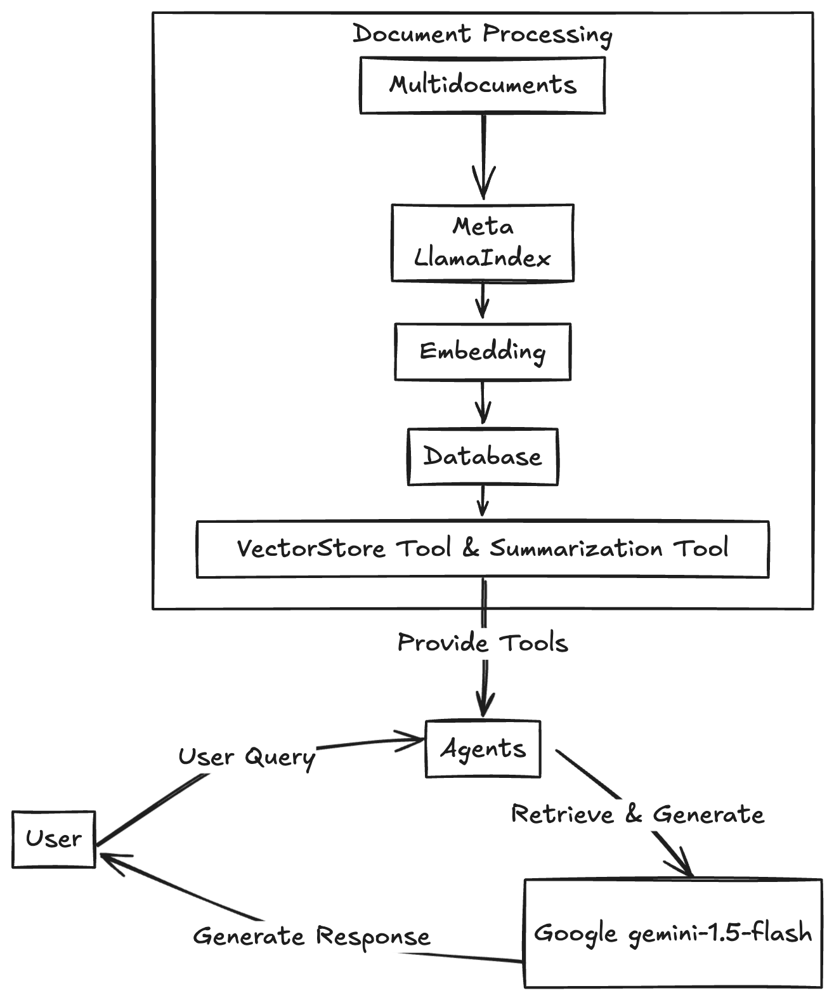

# Expert Assistant

The Expert Assistant is a Streamlit application designed to interact with users by answering queries related to uploaded documents. It leverages the capabilities of the `llama_index` library and the `Gemini` language model to provide contextually relevant responses.

## Features

- **Document Upload**: Users can upload multiple documents in PDF, TXT, or DOCX formats.
- **Interactive Chat**: Users can interact with the assistant by asking questions related to the uploaded documents.
- **Contextual Responses**: The assistant uses chat history to provide contextually aware responses.
- **Powered by LlamaIndex and Gemini**: Utilizes advanced indexing and language modeling for efficient information retrieval and response generation.

## Screenshots

### Document Upload


### Interactive Chat


## Installation

To run the Expert Assistant, ensure you have the following prerequisites:

1. **Python Environment**: Python 3.8 or higher is recommended.
2. **Virtual Environment**: It's advisable to use a virtual environment to manage dependencies.

### Steps to Install

1. **Clone the Repository**:
   ```bash
   git clone https://github.com/your-repo/streamlit-rag.git
   cd streamlit-rag
   ```

2. **Create and Activate a Virtual Environment**:
   ```bash
   python -m venv venv
   source venv/bin/activate  # On Windows use `venv\Scripts\activate`
   ```

3. **Install Dependencies**:
   ```bash
   pip install -r requirements.txt
   ```

## Usage

1. **Run the Application**:
   ```bash
   streamlit run streamlit-rag/streamlit-rag/expert_assistant_app.py
   ```

2. **Upload Documents**:
   - Use the sidebar to upload documents. Supported formats are PDF, TXT, and DOCX.

3. **Interact with the Assistant**:
   - Enter your queries in the chat input field. The assistant will respond based on the content of the uploaded documents and the context of the conversation.

## Application Structure

- **Sidebar**: Allows users to upload source documents.
- **Main Section**: Displays the chat history and provides an input field for user queries.

## Technical Details

The Expert Assistant application is built using an agentic Retrieval-Augmented Generation (RAG) architecture, leveraging the capabilities of LlamaIndex and the Gemini language model. This architecture allows the application to efficiently retrieve and generate contextually relevant responses based on user queries and uploaded documents.

### Architecture Overview

1. **Document Upload and Indexing**:
   - Users upload documents in various formats (PDF, TXT, DOCX) through the Streamlit interface.
   - The documents are processed and indexed using LlamaIndex, which creates a vector store and object index. This indexing facilitates efficient retrieval of relevant information.

2. **Retrieval-Augmented Generation (RAG)**:
   - The application uses a RAG approach, where the ReActAgent retrieves relevant information from the indexed documents and uses the Gemini language model to generate responses.
   - The agent is designed to answer queries by utilizing the tools provided (i.e., the indexed documents) and can incorporate chat history for context.

3. **Gemini Language Model**:
   - The Gemini model is used to generate natural language responses. It is configured with specific parameters such as temperature and max output tokens to control the response style and length.

4. **Chat Interface**:
   - The main section of the app displays the chat history and allows users to input queries. The chat history is used to provide context for generating responses.

### Architecture Diagram

Below is a conceptual architecture diagram illustrating the flow of data and interactions within the Expert Assistant application:



*Note: Replace the placeholder with an actual diagram image.*

### Key Components

- **LlamaIndex**: Facilitates the creation of vector and object indices from uploaded documents, enabling efficient retrieval.
- **ReActAgent**: An agent that processes user queries, retrieves relevant information, and generates responses using the Gemini model.
- **Gemini Model**: A language model that generates contextually relevant responses based on retrieved information and chat history.

This architecture ensures that the Expert Assistant can provide accurate and contextually aware responses to user queries, leveraging the power of both retrieval and generation techniques.

## Environment Variables

- **GOOGLE_API_KEY**: Ensure this environment variable is set with your Google API key for accessing the Gemini model.

## Contributing

Contributions are welcome! Please fork the repository and submit a pull request with your changes.

## License

This project is licensed under the MIT License. See the [LICENSE](LICENSE) file for details.

## Acknowledgments

- [Streamlit](https://streamlit.io/)
- [LlamaIndex](https://github.com/llama-index)
- [Gemini Model](https://gemini-model.com)

For more information, visit the [project repository](https://github.com/your-repo/streamlit-rag).